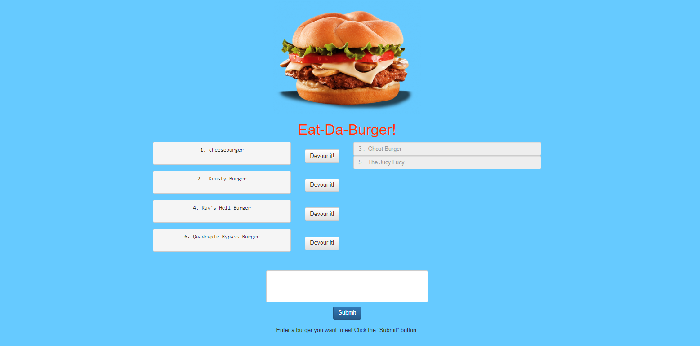

# Sequelized Burger Application

## Getting Started

Created a Sequelized Burger app. Eat-Da-Burger! is a restaurant app that lets users input the names of burgers they'd like to eat. 
Whenever a user submits a burger's name, my app will display the burger on the left side of the page -- waiting to be devoured. 
Each burger in the waiting area also has a Devour it! button. When the user clicks it, the burger will move to the right side of the page. 
My app will store every burger in a database, whether devoured or not.

## Built With

- express
- express-handlebars
- method-override
- body-parser
- MySQL
- Sequelize
